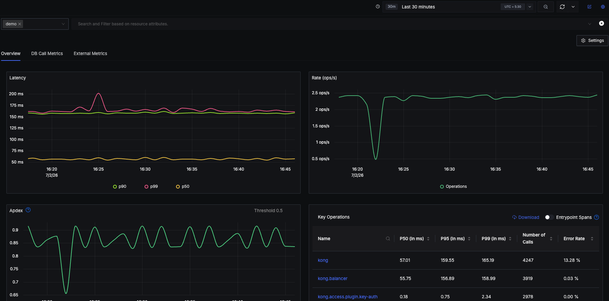
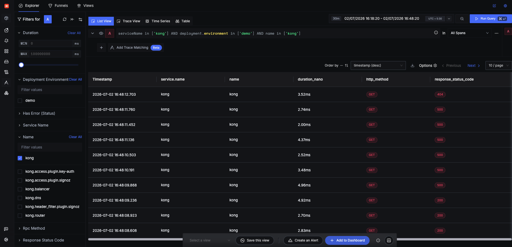
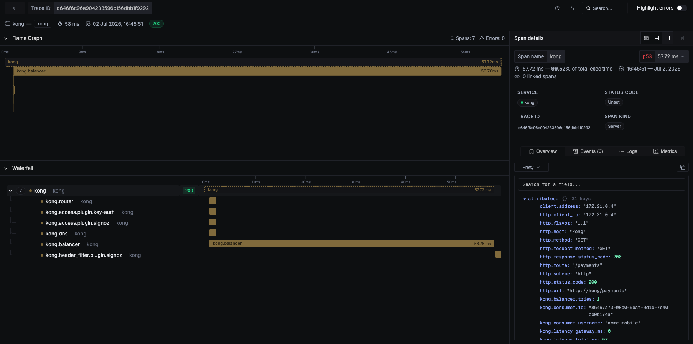
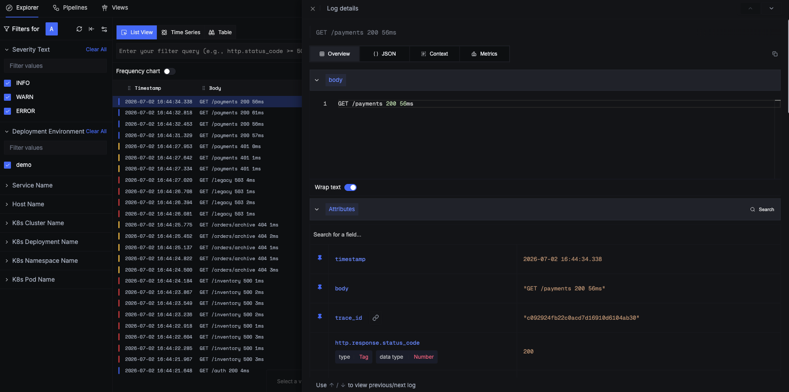
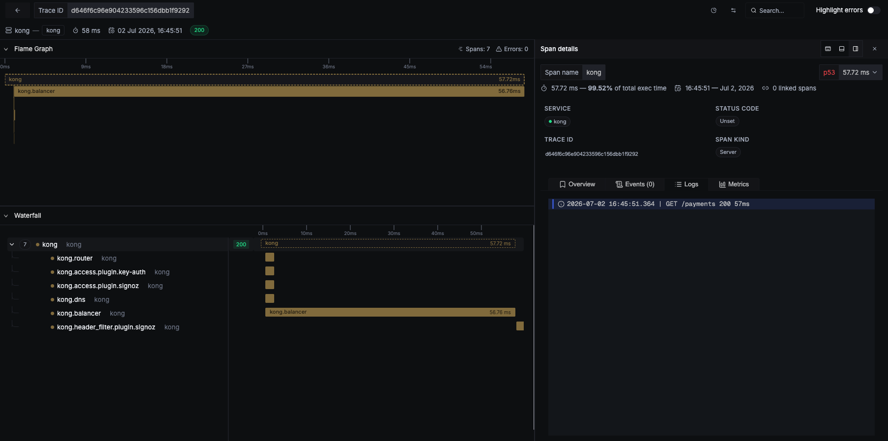

# kong-plugin-signoz

Kong Gateway plugin that sends traces and request logs to [SigNoz](https://signoz.io).

Traces are exported through Kong's bundled [OpenTelemetry plugin](https://developer.konghq.com/plugins/opentelemetry/), with the request span enriched with Kong context: service, route, consumer, and the latency split between Kong and the upstream. Logs are one structured record per request (`GET /payments 200 28ms`), linked to the trace, with the same context as queryable attributes.

Supports Kong Gateway 3.6+ (open-source and Enterprise), OTLP over HTTP.

## What it looks like

Kong as a service in SigNoz, with latency percentiles, request rate, Apdex, and error rate:



Gateway traffic in the Traces Explorer, filterable by service, route, consumer, status, or duration:



Each trace shows Kong's internal phases in the waterfall. The root span carries the enriched attributes: `http.route`, `kong.consumer.username`, `kong.balancer.tries`, and the `kong.latency.*` split that shows whether time went to Kong or the upstream:



Every request produces one log record, color-coded by status class. Logs and traces link both ways: a log line opens its trace, and the trace view shows the request's log:





## Install

```sh
luarocks install kong-plugin-signoz
```

Add `signoz` to the plugins list in `kong.conf` (or `KONG_PLUGINS`) on every node:

```ini
plugins = bundled,signoz
```

## Setup

1. Enable Kong's tracer (required for traces; logs flow without it):

```ini
tracing_instrumentations = all
tracing_sampling_rate    = 1.0
```

2. Get your ingestion endpoint and key: SigNoz Cloud under **Settings → Ingestion** ([docs](https://signoz.io/docs/ingestion/signoz-cloud/keys/)); self-hosted, use your collector's OTLP/HTTP port (`4318`), no key.

3. Enable the plugin:

```sh
curl -X POST http://localhost:8001/plugins \
  --data "name=signoz" \
  --data "config.exporter.endpoint=https://ingest.<region>.signoz.cloud:443" \
  --data "config.exporter.key=<your-ingestion-key>"
```

4. Send a request through the gateway. Kong shows up under Services in SigNoz, spans in the Traces Explorer, one log per request in the Logs Explorer.

For `https://` endpoints, Kong needs a CA trust store: `lua_ssl_trusted_certificate = system`, `lua_ssl_verify_depth = 3`. Errors are logged with a `[signoz]` prefix and in queue warnings.

## Configuration

```yaml
config:
  resource:
    service_name: kong
    deployment_environment: production
  exporter:
    endpoint: https://ingest.<region>.signoz.cloud:443   # http(s) only
    key: <ingestion-key>                                 # Kong Vault-referenceable
  traces:
    enabled: true
    sampling_rate: 1.0
  logs:
    enabled: true
```

All fields, defaults, and emitted attributes: [docs/reference.md](docs/reference.md).

## What gets captured

Each trace span and request log carries:

- **Request:** method, path, scheme, protocol version, user agent
- **Response:** status code, request and response sizes
- **Timing:** total duration, split into gateway (Kong) latency and upstream latency
- **Kong context:** service, route, consumer (when authenticated), retry count, upstream status
- **Network:** client address, upstream address
- **Identity:** service name, environment, hostname, node ID, Kong version

Never captured: headers, query strings, request and response payloads.

## Built on Kong

- Trace export is delegated to Kong's bundled OpenTelemetry plugin; the request log is built with Kong's public PDK (`kong.log.serialize`).
- Metrics and runtime/error logs are left to Kong's own plugins: native OTLP metrics (Gateway 3.13+) and the bundled OpenTelemetry plugin.
- The plugin warns at startup if the tracer is off, or if the bundled `opentelemetry` plugin is enabled alongside (spans would export twice).

## Development

`docs/examples/` runs Kong DB-less with the plugin source mounted. Tests: `busted spec/unit`. Lint: `luacheck kong spec`.

## Support

Maintained by SigNoz. [Issues](https://github.com/SigNoz/kong-plugin-signoz/issues) · [Docs](https://signoz.io/docs/integrations/outposts/kong/)

## License

See [LICENSE](LICENSE).
